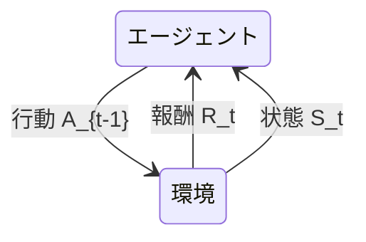

# MDP と TD 学習

教材: Sutton & Barto 第3章（MDP）、第4章（動的計画法、必要なら）、第5章（モンテカルロ法）、第6章（TD 学習）
この範囲は章番号が初版と第2版で揃っているので、手元の初版（邦訳2000）で読める。
第2版の PDF は[著者サイト](http://incompleteideas.net/book/the-book-2nd.html)にある。

## この章で説明できるようになること

- 強化学習の問題設定を、状態・行動・報酬・遷移で書ける
- 価値関数 V と Q の違いと、ベルマン方程式が何を言っているかを説明できる
- モンテカルロ法と TD 学習の違いを、いつ更新するかの観点で説明できる
- ポケモンカードの対戦を、この枠組みに当てはめて書ける

## 0. 用語

| 項目 | 英語 | 記号 | 説明 |
| --- | --- | --- | --- |
| 状態 | state | $s$ | 環境の情報のまとまり。エージェントが直接観測できるとは限らない |
| | |  $S$ | 状態の全体集合 |
| 初期状態分布 | initial state distribution | $\mu(s)$ | エピソードの開始時に状態 $s$ である確率分布 |
| 観測 | observation | $o$ | エージェントが観測する環境の情報のまとまり |
| 行動 | action | $a$ | エージェントが選択できる操作 |
| | |  $A$ | 行動の全体集合 |
| | |  $A(s)$ | 状態 $s$ で選択可能な行動の集合 |
| 報酬 | reward | $r$ | エージェントの目的や目標を定量化したもの |
| | |  $R$ | 報酬の全体集合 |
| 遷移確率 | transition probability | $p(s' \mid s,a)$ | 状態 $s$ で行動 $a$ を取ったときに次の状態 $s'$ になる確率 |
| 割引率 | discount rate | $\gamma$ | 将来獲得する報酬の現在価値を決める係数 |
| 方策 | policy | $\pi(a \mid s)$ | 状態 $s$ で行動 $a$ を選ぶ確率 |
| エピソード | episode | - | 終端状態に達するまでの一連の状態・行動・報酬の列 |
| 終端状態 | terminal state | - | エピソードが終了する状態 |

## 1. 問題設定（MDP）

> [!NOTE]
> - 状態 s、行動 a、報酬 r、遷移確率、割引率 γ
> - エピソード（1試合）と、終端状態
> - 方策 π(a|s)（確率で手を選ぶ／決定的に選ぶ）

<!-- ここに自分の言葉でまとめる -->

### MDP

MDP（Markov Decision Process、マルコフ決定過程）は、強化学習の問題設定の基本となる枠組みで、状態、行動、報酬、遷移確率、割引率から構成される。



MDP のダイナミクス（dynamics: 環境の振る舞いを決定する確率的なルール）は次のように表される。

```math
p(s',r \mid s,a) = \Pr \{ S_t = s', R_t = r \mid S_{t-1} = s, A_{t-1} = a \}
```

このとき、

```math
\sum_{s' \in S} \sum_{r \in R} p(s',r \mid s,a) = 1 \qquad \forall s \in S, a \in A(s)
```

マルコフ決定過程では、環境のダイナミクスの特徴はすべて $p$ で与えられる確率によって決定される。すなわち、次の状態や報酬の分布は、直前の状態と行動のみに依存し、それより過去のすべての状態や行動には全く依存しない。これをマルコフ性（Markov property）と呼ぶ。

さらに、状態 $s'$ への遷移確率（transition probability）を $p(s' \mid s,a)$ と表すと、

```math
p(s' \mid s,a) = \sum_{r \in R} p(s',r \mid s,a)
```

となり、報酬 $r$ を考慮しない場合の遷移確率が得られる。これにより、状態の遷移だけに注目した解析や方策の評価が可能になる。

また、期待報酬 $r$ は、直前の状態 $s$ で行動 $a$ を取った場合に、次のように表され、

```math
r(s,a) = \sum_{r \in R} r \sum_{s' \in S} p(s',r \mid s,a)
```

さらに状態 $s'$ への遷移を考慮した期待報酬 $r$ は、次のように表される。

```math
r(s,a,s') = \sum_{r \in R} r \frac{p(s',r \mid s,a)}{p(s' \mid s,a)}
```
  
これにより、状態の遷移を考慮せずに、特定の状態 $s$ で行動 $a$ を取ったときに得られる報酬の分布を解析することや、さらに状態 $s'$ への遷移を考慮した期待報酬が解析可能となる。

### 方策

<!-- π(a|s)。確率で選ぶ場合と、決定的に選ぶ場合。方策が決まると、ダイナミクス p と組み合わせて何が定まるか -->

方策とは、エージェントが各状態においてどの行動を選択するかを定めるルールのことである。

- 状態 $s$ から確率的に行動を選ぶ場合は $\pi(a \mid s)$ で表される
- 一方で、決定的に行動を選ぶ場合は $\pi(s)$ で表される。決定的方策は、選んだ行動の確率が 1、他が 0 になる確率的方策の特別な場合とみなせる

$\pi$ が決まると、ダイナミクス $p$ と組み合わせて、エージェントの軌跡（trajectory: 状態・行動・報酬の列）の確率分布がすべて定まる。

```math
\Pr \{S_0 = s_0, A_0 = a_0, R_1 = r_1, \dots, S_T = s_T \mid \pi\} = \mu(s_0) \prod_{t=0}^{T-1} \pi(a_t \mid s_t) p(s_{t+1}, r_{t+1} \mid s_t, a_t)
```

強化学習手法は、経験の結果として方策 $\pi$ を改善し、最適な行動選択を学習することを目的とする。

- $\pi(a \mid s)$ は、各状態 $s$ に対して $\sum_{a \in A(s)} \pi(a \mid s) = 1$ が成り立つ
- ポケモンカードでは $A(s)$ が状態ごとに変わる。すなわち $\pi(\cdot \mid s)$ の選べる集合が局面ごとに変わる（合法手が局面ごとに異なるため）

### 収益とエピソード

収益（return）とは、ある時刻 $t$ から将来にわたって得られる報酬の総和であり、次のように表される。

```math
G_t = R_{t+1} + R_{t+2} + \cdots + R_T
```

> [!TIP]
> $G_t$ は時刻 $t$ だけでなく、時刻 $t$ から後に得られる報酬を示すことに注意

最後の時間ステップ $T$ が自然に定義される場合、エピソード（episode）は $t=0$ から $t=T$ までの一連の状態・行動・報酬の列として表される。各エピソードは終端状態（terminal state）と呼ばれる特別な状態で終了する。

このようなエピソードを持つタスクをエピソード型タスク（episodic task）と呼ぶ。
一方、エピソードが明確に区切られない、すなわち $T \to \infty$ となるタスクを連続タスク（continuing task）と呼ぶ。

連続タスクは、エピソードが明確に区切られないため、将来の報酬を割引率 $\gamma$ を用いて現在価値に換算した割引収益を用いて評価される。

```math
\begin{aligned}
G_t &= R_{t+1} + \gamma R_{t+2} + \gamma^2 R_{t+3} + \cdots \\
&= \sum_{k=0}^{\infty} \gamma^k R_{t+k+1}
\end{aligned}
```

また、割引収益は以下のように再帰的に定義できるため、動的計画法や TD 学習などの手法で効率的に計算することが可能である。

```math
\begin{aligned}
G_t &= R_{t+1} + \gamma R_{t+2} + \gamma^2 R_{t+3} + \cdots \\
&= R_{t+1} + \gamma (R_{t+2} + \gamma R_{t+3} + \cdots) \\
&= R_{t+1} + \gamma G_{t+1}
\end{aligned}
```

### 割引率 γ の役割

<!-- 0 ≤ γ ≤ 1。γ = 0 と γ → 1 で、何を重く見ることになるか。エピソード型で終端が必ず来るなら γ = 1 でも収益が有限になること（6節の 24位の設定につながる） -->

割引率（discount rate） $\gamma$ は、将来の報酬をどの程度重視するかを決定するパラメータであり、 $0 \leq \gamma \leq 1$ の範囲で設定される。 $\gamma = 0$ の場合、エージェントは目先の報酬のみを重視し、 $\gamma \to 1$ の場合、将来の報酬も重視することになる。

報酬が定数 1 である場合、連続タスクの割引収益は次のように計算される。

```math
\begin{aligned}
G_t &= 1 + \gamma + \gamma^2 + \cdots \\
&= \sum_{k=0}^{\infty} \gamma^k \\
&= \frac{1}{1-\gamma} \quad (\gamma < 1)
\end{aligned}
```

$\gamma = 1$ で、かつ報酬が入り続ける場合は、収益が無限大となる。このような場合は、割引率を 1 に設定することはできない。

```math
G_t = 1 + 1 + 1 + \cdots = \sum_{k=0}^{\infty} 1 = \infty
```

なお、一般には、報酬は 1 とは限らず、さまざまな値を取ることがある。報酬を $\left| R \right| \leq R_{\max}$ で上から抑えられるとすると、連続タスクの割引収益は次のように評価できる。

```math
\begin{aligned}
\left| G_t \right| &\leq R_{\max} + \gamma R_{\max} + \gamma^2 R_{\max} + \cdots \\
&= \sum_{k=0}^{\infty} \gamma^k R_{\max} \\
&= \frac{R_{\max}}{1-\gamma} \quad (\gamma < 1)
\end{aligned}
```

一方、報酬が定数 1 である場合のエピソード型タスクにおける割引収益は次のように計算される。

```math
\begin{aligned}
G_t &= 1 + \gamma + \gamma^2 + \cdots + \gamma^{T-t-1} \\
&= \sum_{k=0}^{T-t-1} \gamma^k \\
&= \frac{1-\gamma^{T-t}}{1-\gamma} \quad (\gamma < 1)
\end{aligned}
```

エピソード型タスクでは終端が必ず来るため、 $\gamma = 1$ としても収益が有限になる。

```math
G_t = 1 + 1 + \cdots + 1 = \sum_{k=0}^{T-t-1} 1 = T-t
```

> [!NOTE]
> ポケモンカードの場合、 $\gamma = 1$ 、勝ちの報酬を 1、負けの報酬を -1、途中を 0 とすると、割引収益は全ステップで 1 または -1 となる。
>
> ```math
> \begin{aligned}
> G_t &= 0 + 0 + \cdots + 0 + 1  = 1 \quad \text{(勝ちの場合)} \\
> G_t &= 0 + 0 + \cdots + 0 + (-1) = -1 \quad \text{(負けの場合)}
> \end{aligned}
> ```

### まとめ: MDP の構成要素

<!-- 状態、行動、報酬、ダイナミクス p、割引率 γ を組として並べ直す。「確認」の1つ目に答える形にする -->

MDP は、状態、行動、報酬、遷移確率、割引率の組として形式的に定義される。すなわち、MDP は次の 5 つの要素から構成される。

- 状態集合 $S$ : 環境が取りうるすべての状態の集合
- 行動集合 $A(s)$ : 状態 $s$ で取りうるすべての行動の集合
- 報酬関数 $r(s, a)$ : 状態 $s$ で行動 $a$ を取ったときに得られる報酬
- 遷移確率 $p(s' \mid s, a)$ : 状態 $s$ で行動 $a$ を取ったときに次の状態が $s'$ となる確率
- 割引率 $\gamma$ : 将来の報酬をどの程度重視するかを決定するパラメータ

> [!TIP]
> 方策 $\pi(a \mid s)$ は MDP の構成要素ではなく、エージェントの側にある。学習とは、環境（遷移確率 $p$ と報酬関数 $r$）を固定したまま、方策 $\pi$ を変えていくことである。

ポケモンカードの MDP における各要素は次のように対応する。

- 状態集合 $S$ : ゲームの盤面の状況、手札、山札、トラッシュ、サイドの中身
- 行動集合 $A(s)$ : プレイヤーが取りうるすべての合法手（カードを出す、攻撃するなど）
- 報酬関数 $r(s, a)$ : 勝利で 1、敗北で -1、その他の行動で 0
- 遷移確率 $p(s' \mid s, a)$ : プレイヤーが行動 $a$ を取ったときに次の状態 $s'$ になる確率
- 割引率 $\gamma$ : 将来の報酬をどの程度重視するか

> [!NOTE]
> - ポケモンカードでは状態集合をすべて観測できない。具体的には、相手の手札、山札、サイドの中身は観測できない。自分の山札、サイドも最初に山札のカードをサーチするまでは観測できない。
> - 24位のチームも割引率は 1.0 と設定している。
> - ポケモンカードにおける方策 $\pi(a \mid s)$ は、エンジンが提示した合法手のうち、どれをどの確率で選ぶか。これが学習で動かす対象である。

## 2. 部分観測（POMDP）

> [!NOTE]
> - 相手の手札や山札が見えない場合、何が変わるか
> - 観測から方策を決めるとはどういうことか

### 状態と観測のずれ

<!-- 観測 o が状態 s の一部でしかないとき、同じ観測から違う遷移が起きる。1節のマルコフ性の仮定がどう崩れるか -->

### POMDP の枠組み

<!-- 状態・行動・観測・観測確率。信念状態（belief state）とは何を表すか -->

### 観測から方策を決める

<!-- π(a|o) を直接学ぶ。過去の履歴を使う方法（履歴の連結、RNN、Transformer）と、それが何を補っているか -->

### ポケモンカードでは何が見えないか

<!-- 相手の手札、山札の並び、サイドの中身。ptcg-abc の「手番のプレイヤーが観測できる情報だけを使う」という契約と結びつける -->

## 3. 価値関数

> [!NOTE]
> - 状態価値 V(s) と行動価値 Q(s, a)
> - ベルマン方程式（期待値の再帰）
> - 最適方策と最適価値

### 状態価値 V

<!-- 方策 π のもとでの期待収益。1節の G_t とどうつながるか -->

### 行動価値 Q

<!-- 状態 s で行動 a を取り、その後は π に従う場合の期待収益。V との違いは何か -->

### V と Q の関係

<!-- π で平均すると V になること。p と r を使うと Q を V で書けること -->

### ベルマン期待方程式

<!-- 1節の G_t = R_{t+1} + γG_{t+1} の期待値を取った形。何が再帰になっているか -->

### 最適価値と最適方策

<!-- ベルマン最適方程式。max が入ると何が変わるか。最適方策が決定的でよい理由 -->

### 動的計画法との関係

<!-- 方策評価と方策改善、方策反復と価値反復。p が分かっている前提が必要なこと（4節はこの前提を外す） -->

## 4. モンテカルロ法と TD 学習

> [!NOTE]
> - モンテカルロ法: エピソードが終わってから、実際のリターンで更新する
> - TD 学習: 1ステップ進むごとに、次の状態の予測を使って更新する（ブートストラップ）
> - TD 誤差
> - n-step のリターン

### 環境のモデルを使わない学習

<!-- p が分からないとき、経験（サンプル）から価値を推定する。3節の動的計画法との違い -->

### モンテカルロ法

<!-- エピソードの終了後に、実際の G_t で更新する。更新式と、必要になる前提（エピソード型であること） -->

### TD(0)

<!-- 1ステップ進むごとに、次の状態の推定値で更新する。更新式を書き、モンテカルロ法と並べる -->

### TD 誤差

<!-- δ = R_{t+1} + γV(S_{t+1}) − V(S_t)。何と何の差か -->

### 偏りと分散

<!-- モンテカルロ法は偏りがなく分散が大きい、TD は偏りがあり分散が小さい。なぜそうなるか -->

### n-step リターン

<!-- 何ステップ進んでから推定値に切り替えるか。1ステップと全体の間を取る（2章の GAE につながる） -->

## 5. 制御（価値ベース）

> [!NOTE]
> - SARSA と Q 学習の違い（この違いが、4章のオンポリシーとオフポリシーにつながる）
> - ε-greedy による探索と活用

### 予測から制御へ

<!-- 価値を推定するだけでなく、方策を良くする。一般化方策反復（評価と改善の繰り返し） -->

### SARSA

<!-- 更新に、実際に次に選んだ行動の Q を使う。更新式 -->

### Q 学習

<!-- 更新に、次の状態での Q の最大値を使う。更新式。SARSA との1点の違いがどこか -->

### 探索と活用

<!-- ε-greedy。探索しないと何が起きるか。この違いが4章のオンポリシー／オフポリシーにつながること -->

### カードゲームでの探索

<!-- 合法手が局面ごとに変わり、無作為な手が致命傷になりうる。ε-greedy が向かない理由を考える -->

## 6. ポケモンカードに当てはめる

| 枠組み | ポケモンカードでは何か | 補足 |
|---|---|---|
| 状態 | | 対局の完全な状態（相手の手札と山札の中身、並び順を含む）。自分からは見えない |
| 観測 | | 自分から見える情報。方策に入力するのはこちら。同じ観測でも、見えない部分によって次の展開が変わる |
| 行動 | | エンジンが列挙する合法手から選ぶ。数は局面ごとに変わる |
| 報酬 | | 上位チームはほぼ勝敗のみ（勝ち +1、負け −1） |
| エピソード | | 1試合。1試合あたりの判断は100回を超える |
| 割引率 | | 24位の設定は γ = 1.0 |

<!-- 表を埋め、気づいたことを書く -->

## 確認

- [ ] V と Q の違いを、式を使わずに説明できる
- [ ] TD 誤差が何と何の差かを説明できる
- [ ] 1試合に100回を超える判断があり、報酬が最後にしか来ないことが、学習にどう効くかを説明できる
- [ ] ε-greedy でランダムな手を打つことが、カードゲームで何を壊しうるかを説明できる

## 手を動かす

- ptcg-abc の `docs/research/reproduce/24-population-rl.md` の段階4を読み、1試合あたりの判断の数と、1サイクルの局数を確かめる
- 24位の設定（`src/agents/dragapult/ppo/config.json`）の `gamma` と `reward` を見て、この章の記号と対応づける

## メモ

<!-- 疑問、後で調べること -->

> [!NOTE]
> 方策を直接学ぶ方が目的に近いのに、価値ベースの手法はなぜ用いられるのか？
> - 表し方の違いで、オフポリシー（データの使い回し）、推定のばらつき、行動空間の形、確率的な方策の可否が変わるらしい
> - 本ノートの §2（価値ベースとの違い） と §4（どちらが適しているか）で確かめる
 